# Intro

The Netdevops survey is a community driven survey that is designed to help understand how network operators and engineers are using automation to operate their network today.

The 2016 Edition collected responses from 307 participants from Fall 2016

If you want to get involved or are looking for more information, please visit [our github page](https://github.com/dgarros/netdevops-survey/)

# 2016 Report
## Operation/Management of your network 

--------------

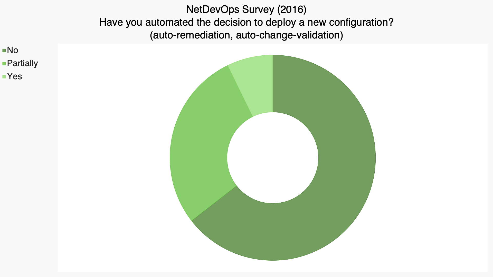

--------------

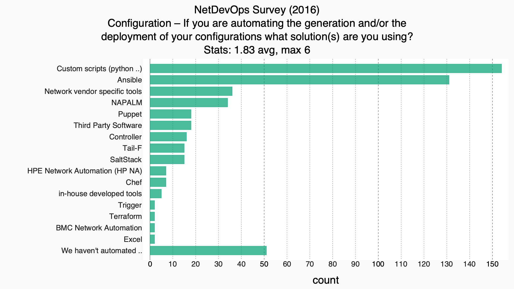

--------------

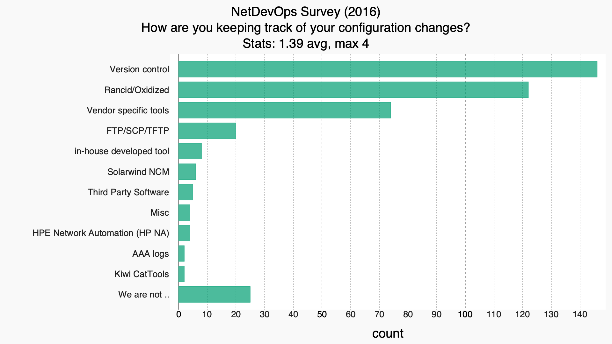

--------------

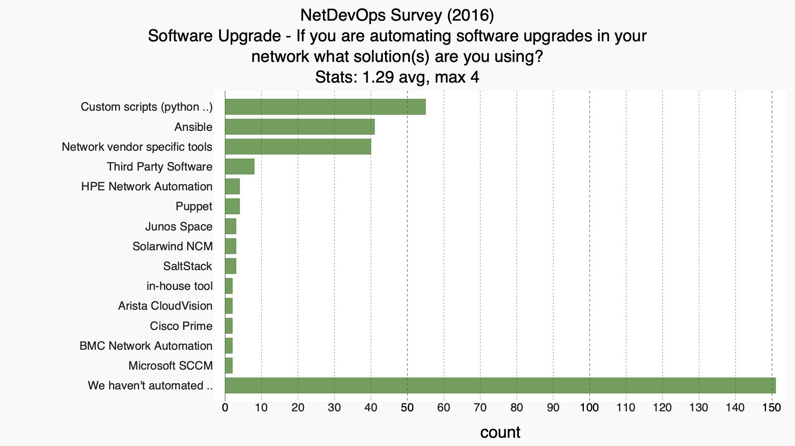

--------------

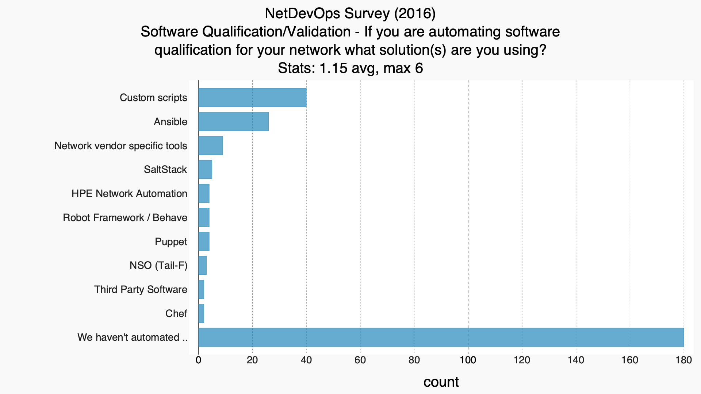

--------------

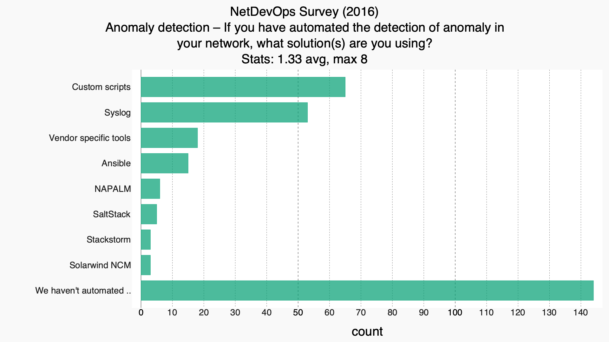

--------------

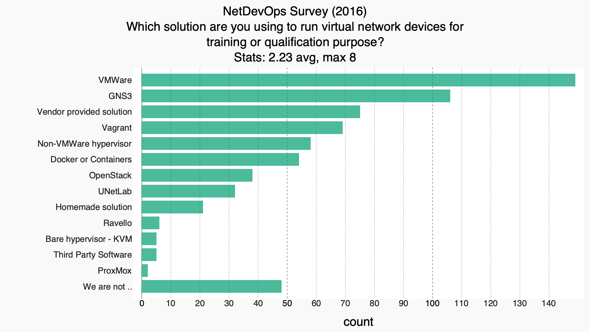

## Your Environment

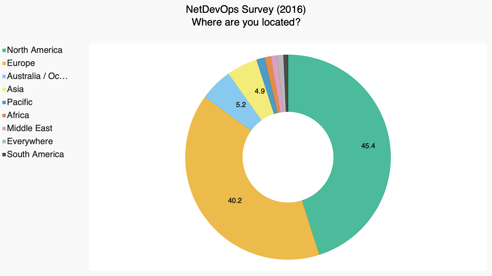

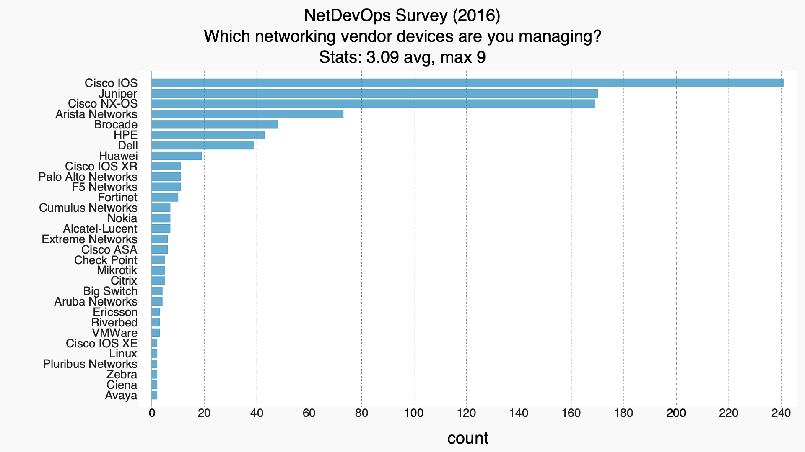

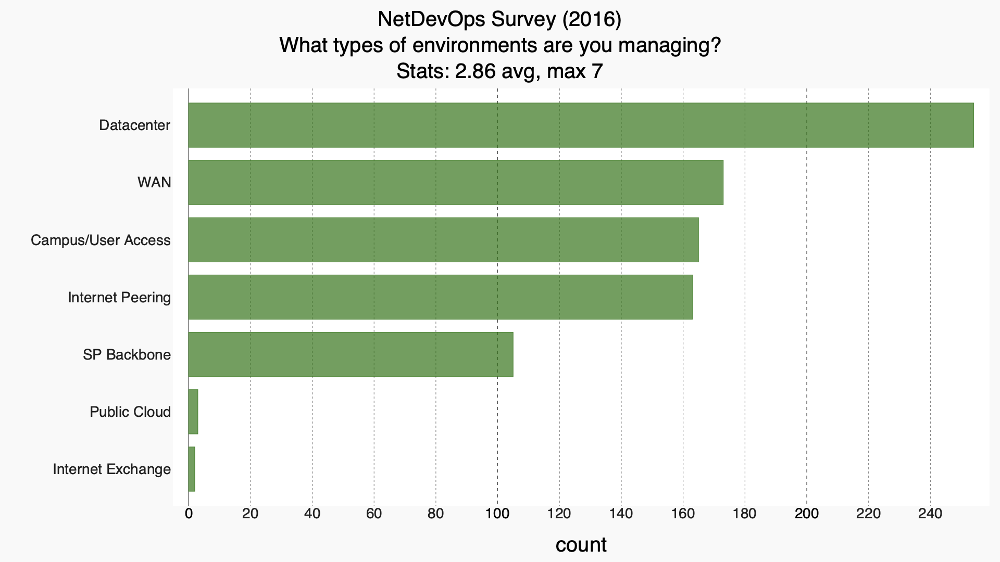

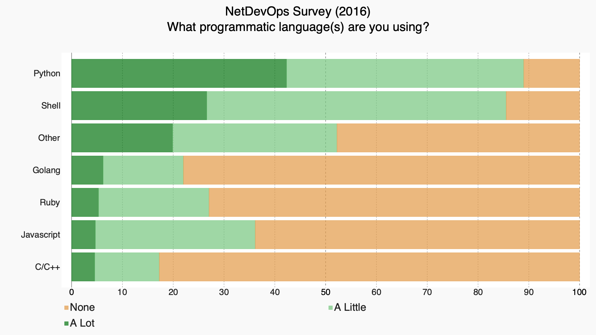

## Industry Trends / Future direction

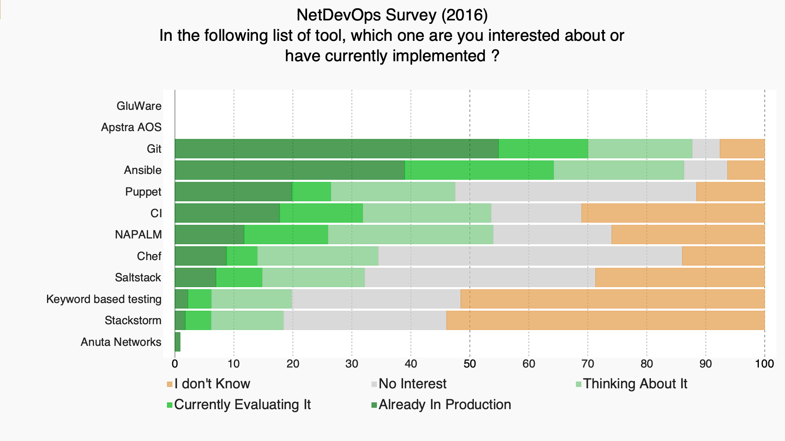

