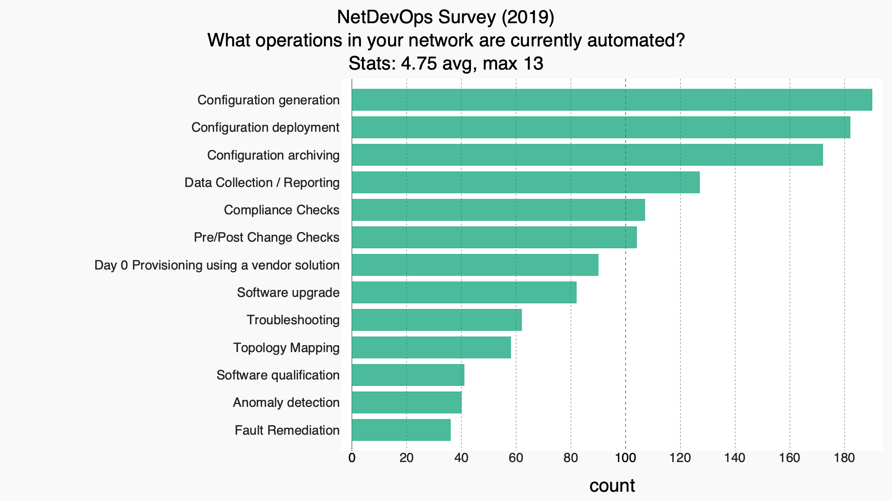

# Intro

The Netdevops survey is a community driven survey that is designed to help understand how network operators and engineers are using automation to operate their network today.

The 2019 Edition collected responses from 293 participants from Oct 10th to Nov 10th 2019. 

Get involved in shaping future editions, or find more information on [our github page](https://github.com/dgarros/netdevops-survey/)

# 2019 Report
## Operation/Management of your network 

--------------

--------------

--------------

--------------

--------------

--------------

--------------

## Your Environment

## Transition to Network Automation

## Industry Trends / Future direction

### Evolution over time

