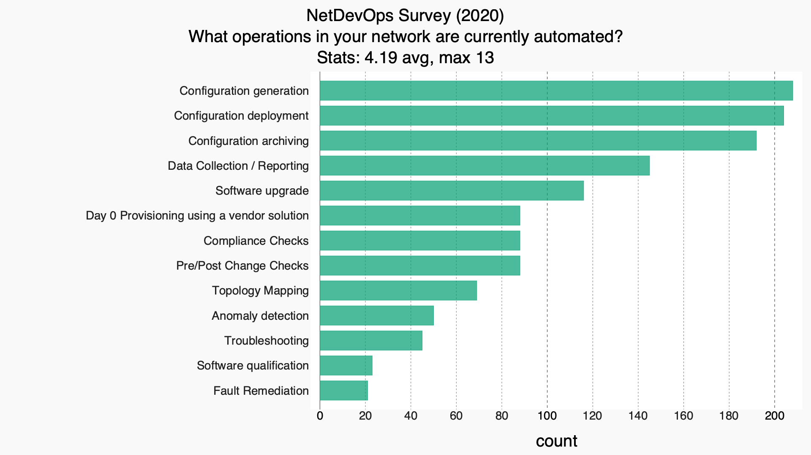
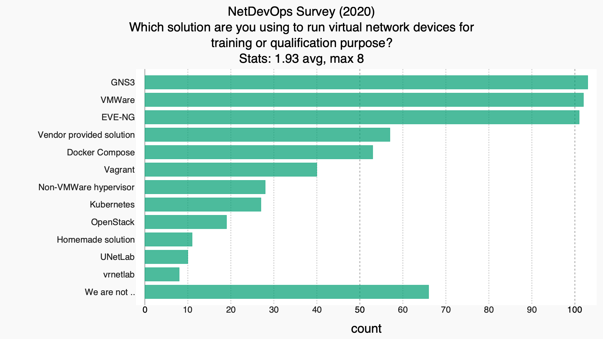
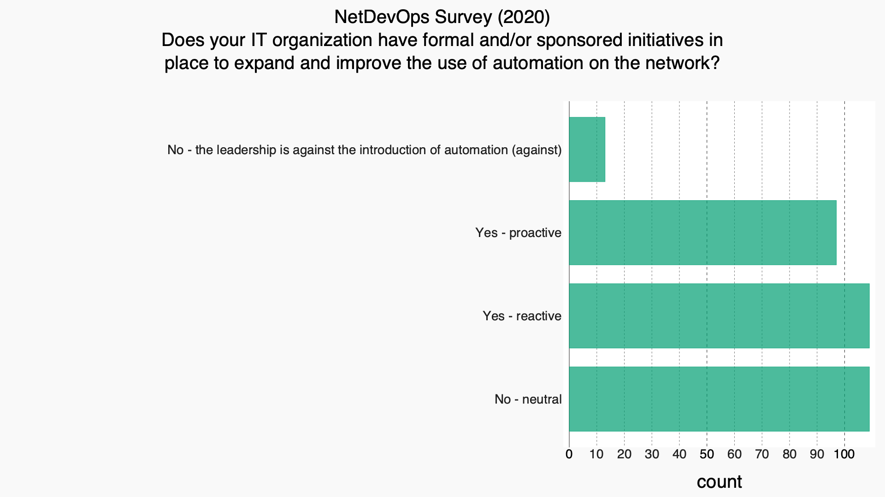
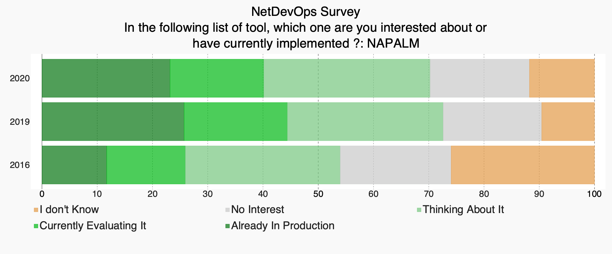

# Intro

The Netdevops survey is a community driven survey that is designed to help understand how network operators and engineers are using automation to operate their network today.

The 2020 Edition collected responses from 333 participants from Sept 30th to Oct 31th 2020. 

Get involved in shaping future editions, or find more information on [our github page](https://github.com/dgarros/netdevops-survey/)

# 2020 Report
## Operation/Management of your network 

--------------

--------------

--------------

--------------

--------------

--------------

--------------

--------------

## Your Environment

## Transition to Network Automation

## Industry Trends / Future direction

### Evolution over time

